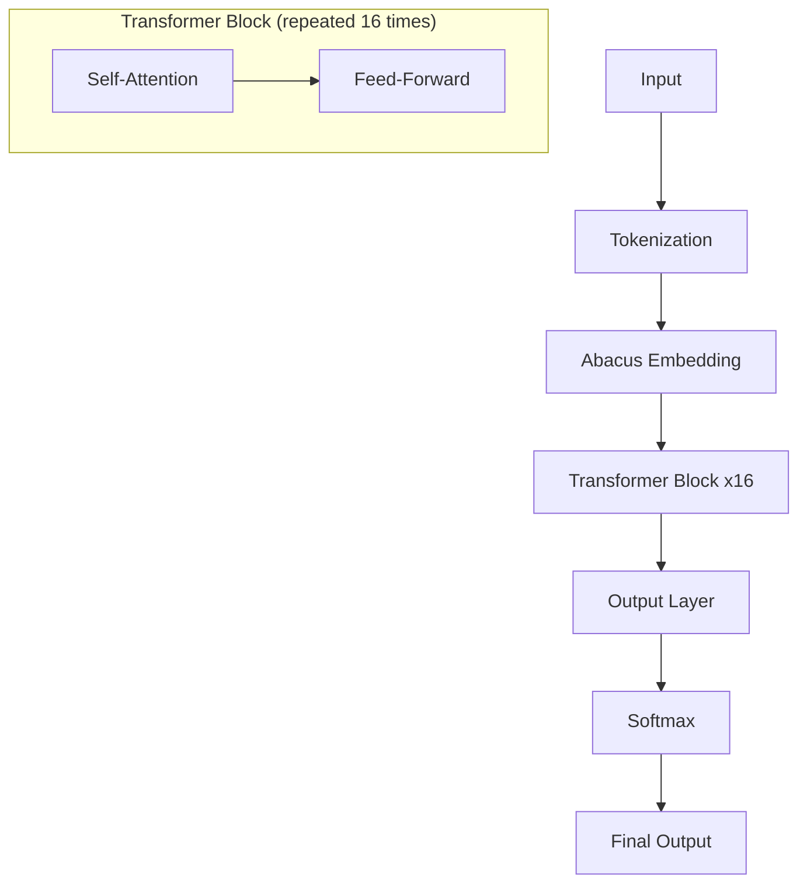

# PyTorch Implementations from Language Models Class

This repository contains various PyTorch implementations of machine learning models and techniques explored in my Language Models class. The code is organized into directories based on specific projects, including MNIST classification, attention mechanisms, and a GPT-style language model.

## Directory Overview

### 1. **MNIST**
- **Description**: This directory contains a simple implementation of a classifier for the MNIST dataset. The code demonstrates basic image classification techniques using PyTorch.
- **Key Features**:
  - Dataset loading and preprocessing.
  - Model definition with fully connected layers.
  - Training and evaluation scripts.

### 2. **Attention**
- **Description**: This directory implements attention mechanisms from scratch. It includes single-headed and multi-headed self-attention, explaining the core concepts behind transformers.
- **Key Features**:
  - Custom attention layer implementations.
  - Visualization of attention weights.
  - Step-by-step demonstration of how attention is computed.

### 3. **GPT**
- **Description**: This directory contains a Jupyter notebook that defines and trains a full language model based on the GPT architecture. The model is trained to generate text in the style of Shakespeare.
- **Key Features**:
  - Full GPT model implementation using PyTorch.
  - Training loop to fine-tune the model on Shakespearean text.
  - Sample text generation to mimic Shakespearean writing style.

## Usage

To use the code in this repository, clone the repository and navigate to the desired directory:

```bash
git clone <repository_url>
cd <directory_name>
```

# Implementing a Minimal Transformer for Addition

## Data Generation and Preprocessing

### Addition Dataset
- Generate pairs of numbers up to a maximum length (e.g., 20 digits)
- Format: `"num1+num2="`
- Example: `"123+456="`
- Train set: 20 million samples
- Test set: 100,000 samples
- Ensure test set contains unique problems not seen in training
- Total possible permutations:
$$
\begin{align*}
\text{Possibilities for length } i &= 9 \times 10^{i-1} \\
\text{Total permutations} &= \sum_{i=1}^{20} (9 \times 10^{i-1})^2 \\
&\approx 8.19 \times 10^{38} \text{ unique problems}
\end{align*}
$$

### Tokenization
- Character-level tokenization
- Vocabulary (14 tokens):
  - Digits: 0-9 (10 tokens)
  - Operations: + (1 token)
  - Equals sign: = (1 token)
  - Special tokens: `<PAD>, <EOS>` (2 tokens)
- Multi-digit numbers are represented as sequences of digit tokens
- Example: `"123+456=" -> [1, 2, 3, 10, 4, 5, 6, 11]`
- Full vocabulary: `['0', '1', '2', '3', '4', '5', '6', '7', '8', '9', '+', '=', '<PAD>', '<EOS>']`

## Model Architecture

### Specifications
- Effective depth: 16 layers
- Hidden size: 1024
- Intermediate size: 2048
- Embedding size: 1024
- Number of attention heads: 16
- Approximate parameter count: 12 million

### Mermaid Diagram

### Layer Dimensions
- Input: `[batch_size, seq_length]`
- Embedding: `[batch_size, seq_length, hidden_size]`
- Transformer Blocks: `[batch_size, seq_length, hidden_size]`
- Output: `[batch_size, seq_length, vocab_size]`

## Key Concepts

### batch_size
- Number of sequences processed in one forward/backward pass
- Affects training efficiency and memory usage
- Does not change model architecture or parameters

### seq_length
- Length of input sequences in the current batch
- Variable, but padded to a consistent length within each batch
- Maximum seq_length determined by model design (e.g., 64 or 128)
- Affects memory usage during processing, not model parameters

### Abacus Embeddings
- Custom positional encoding for numerical tasks
- Assigns same encoding to digits of same significance across numbers
- Allows for length generalization beyond training sequence length

## Training Considerations
- Use AdamW optimizer
- Implement Trapezoid learning rate scheduler
- Mask loss computation to only consider output digits
- Evaluate using exact match accuracy
- Test on both in-distribution and out-of-distribution (longer) sequences

## Implementation Notes
- Use PyTorch for model implementation
- Create custom Dataset and DataLoader classes
- Implement Abacus Embeddings as a custom layer
- Use looped transformer architecture for parameter efficiency
- Ensure model can handle variable sequence lengths up to the maximum


